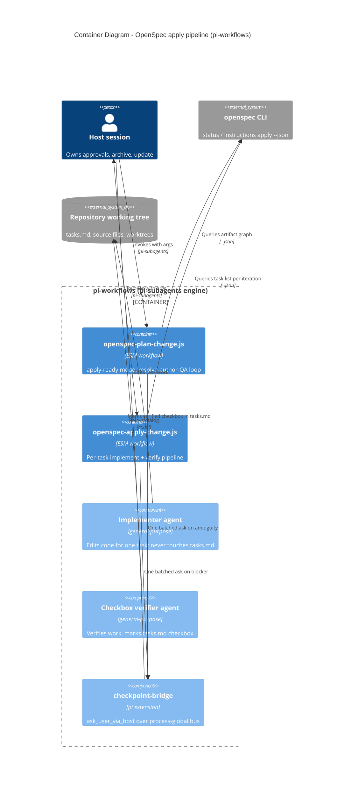
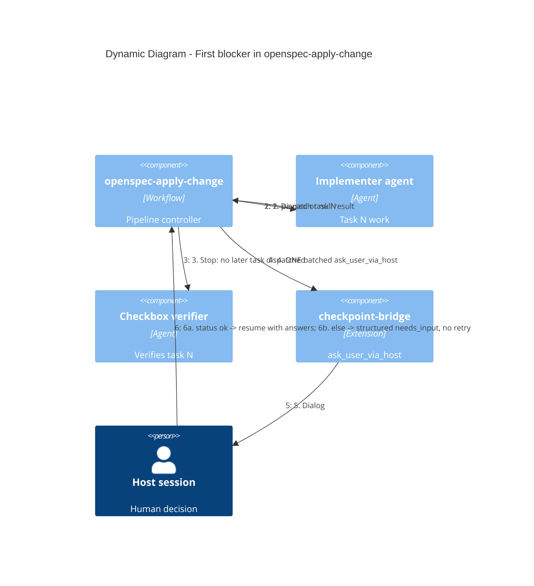

## Context

The pi-workflows repo ships args-driven pi-subagents workflow scripts (ESM `export const meta` bodies validated by `node scripts/check-workflow-syntax.mjs`) plus the `checkpoint-bridge` extension, the ADR-0001 checkpoint channel. ADR-0001 (`docs/adr/ADR-0001-workflow-family-and-checkpoint-channel.md`, the only ADR, accepted and in force) gates every new workflow-family member behind a measured pilot; the 2026-09-06 `openspec-plan-change` pilot satisfied that gate and arms the next two members defined there: the `apply-ready` authoring mode and `openspec-apply-change`.

Today the host session re-invokes `openspec-plan-change` once per planning artifact and hand-drives `openspec instructions apply` task by task. ADR-0001's campaign data identified main-session context growth from exactly this per-artifact loop and per-task coordination chatter as the dominant cost. The host session permanently retains user interviews, approvals, `openspec archive` (including its inline delta-spec sync), and `openspec update`; no workflow ever runs them.

Live CLI shape (verified via `openspec instructions apply --change add-openspec-apply-pipeline --json`): the payload carries `changeName`, `changeDir`, `contextFiles` (proposal/specs paths), `progress {total, complete, remaining}`, `tasks[]`, `state` (`blocked`|`ready`), `missingArtifacts[]`, and an `instruction` string — so apply is only drivable once `tasks` and `validate` artifacts exist, and task progress is derived from `tasks.md` checkboxes.

Dependency sources (each read once, at `openspec/changes/add-openspec-apply-pipeline/` unless noted): `proposal.md` motivated both members and fixed the host-authority boundary; `specs/plan-apply-ready-mode/spec.md` fixed loop-termination, `maxArtifacts`, checkpoint pause semantics, and the CLI-resolved-paths guarantee; `specs/apply-pipeline/spec.md` fixed task sequencing, optional isolation/test gate, the implementer/verifier split, hard-stop escalation, and the archive/update prohibition; `docs/adr/ADR-0001-workflow-family-and-checkpoint-channel.md` fixed the family shape, the process-global bridge bus, and question batching; `openspec-plan-change.js` supplied the agent-prompt constants (`TOOL`, `CONTRACT`, `GRILL`), JSON schemas, and structured return shapes to extend; `openspec-validate-change.js` supplied the house style for named phases and per-agent schemas; `README.md` is the args-contract surface to update.

### Component view

### Dynamic view: blocker flow

## Goals / Non-Goals

**Goals:**

- `openspec-plan-change` gains an `apply-ready` mode that loops resolve→author→QA until every planning artifact is `done` or `skipped`, bounded by a `maxArtifacts` cap, reusing the existing one-shot agent trio per iteration.
- New `openspec-apply-change.js` drives implementation task by task from `openspec instructions apply --json` with a distinct implementer agent and checkbox-verifier agent per task.
- Worktree isolation and a test gate are optional arguments, default off.
- Hard stop on the first paused or null agent result, with exactly one batched `ask_user_via_host` escalation; structured `needs_input` (no retry, no guessing) for any non-success host status.
- Every artifact path and task id comes from the CLI (`resolvedOutputPath`, `tasks[]`); skipped artifacts produce no files.
- README args contracts updated for both surfaces.

**Non-Goals:**

- Running `openspec archive`, `openspec update`, or any delta-spec sync from either workflow — permanently main-session-only (host retains all approvals).
- Interview/grill mechanics: unchanged; the checkpoint channel is used only for material ambiguity (authoring) and blockers (apply).
- Per-recipe or per-schema forks of the pipeline; it stays schema-agnostic behind `--json` payloads.
- In-workflow durable state (journals, resume ledgers): resumption is the host re-invoking the workflow; the CLI status graph is the only state.
- Editing the checkpoint-bridge extension; it is consumed as-is per ADR-0001.

## Decisions

**D1 — `apply-ready` is a new mode inside `openspec-plan-change`, not a second workflow.** The loop re-uses the existing per-artifact agent trio (resolve-snapshot, author, QA) and its prompt constants; each iteration re-runs `openspec status --change <name> --json` (via the existing resolve agent shape) and stops when no artifact is `ready`/`blocked`. The current ADR-0001 refusal in the mode validation is lifted. Alternative considered — a separate orchestrator workflow that shells out to plan-change per artifact: rejected because it duplicates the agent-prompt constants and violates ADR-0001's one-level-composition rule while adding no capability. `one` and `scaffold` behavior remain byte-for-byte backward compatible.

**D2 — `maxArtifacts` counts artifacts authored in this run; the status graph is re-snapshotted after each author+QA.** When the cap is reached (or the graph is settled), the structured return names `remaining` artifacts so a later run resumes without re-authoring. Loop termination follows `specs/plan-apply-ready-mode/spec.md`: only `done` or `skipped` settle an artifact; a `skipped` instruction writes no file. Alternative considered — precomputing the artifact list once and iterating statically: rejected because QA fixes and host edits between iterations change statuses; the CLI is the source of truth (live `instructions` payloads also report `missingArtifacts`, which the loop surfaces rather than guesses around).

**D3 — Pause/resume is stateless.** On `needs_input` the loop returns immediately with the artifact/task, the batched question, and remaining work; the host re-invokes the workflow after deciding. Idempotency comes free from D2 (settled artifacts are never re-authored). Alternative considered — a persistent journal replay: rejected, ADR-0001 explicitly keeps resumption through the host and removed digest-replay complexity from the channel.

**D4 — `openspec-apply-change` has four named phases: Load, Implement, Escalate, Report.** Load runs `openspec instructions apply --json` once and fails fast with `missingArtifacts` if `state` is `blocked`. The Implement phase iterates: re-query `instructions apply --json` (cheap; keeps CLI checkbox progress authoritative), take the next incomplete task, dispatch the implementer agent, then dispatch the checkbox verifier. Report returns `{change, tasks_done, tasks_remaining, blocked_task, needs_input, worktrees[], next}`.

**D5 — Strict agent separation with prompt-level mutation rights.** The implementer's prompt forbids touching `tasks.md` and any `openspec` mutating verb; the checkbox verifier alone reads the implemented work against the task description (and the gated test outcome, when the gate is on), then edits `tasks.md`. Both agents share the `TOOL` + contract constants house style; the verifier gets a JSON schema `{task_id, verified, evidence[], marked}`. Alternative considered — one agent doing both: rejected outright by the spec (`apply-pipeline`: an implementer MUST NOT mark its own checkbox).

**D6 — Isolation and test gate are run-level boolean args applied per task, default off.** `worktree: true` → each implementer creates and works in a task-scoped worktree (pi native worktree tools or `git worktree add`); the workflow reports created worktree paths and the host integrates and removes them — the pipeline never merges into the main tree itself, matching the spec's "untouched until integrated". `testGate: true` (optionally with `testCommand`) → the implementer must run the gated tests and report the outcome; a non-passing outcome is un-implementable and routes through D7. Defaults off per the host intent.

**D7 — Hard stop on the first paused or null result, one batched escalation.** Any implementer/verifier pause, null, or failed gate stops dispatch immediately; the pipeline batches every question about the blocked task into a single `ask_user_via_host` call (ADR-0001: serial host dialogs, so batching is mandatory). Host status `ok` → resume with answers applied; any other status → structured `needs_input` naming the blocked task and the decision needed, no retry, no checkbox marked. The existing `null`-may-mean-deliberate-skip ambiguity (noted in plan-change) is handled by treating null as a blocker, never as success — the safe direction.

**D8 — The archive/update prohibition is prompt-contract enforcement.** The `CONTRACT` block carried into every agent prompt lists the forbidden verbs verbatim (mirroring plan-change's existing "Never run: openspec archive, openspec update" line); there is no code path that invokes them. Trade-off accepted: workflows are prompt-driven, so enforcement is contractual, not sandboxed — the same trust model every other family member already uses.

## Risks / Trade-offs

- [Null agent result is ambiguous between failure and deliberate skip] -> Treated as a blocker with escalation (D7); a skipped task can be re-marked by the host, but a silently unimplemented task could not be recovered.
- [Verifier marks a checkbox without real verification (rubber-stamping)] -> Verifier schema requires `evidence[]` entries; prompt requires reading the implemented diff/files, not trusting the implementer's report; host reviews the final return before archiving anyway.
- [Worktree sprawl — implementers create worktrees that nobody removes] -> Workflow returns every created worktree path; host integrates or removes; worktree mode is opt-in per run (D6).
- [CLI payload/schema drift breaks the loop] -> Workflows stay schema-agnostic behind `--json` (ADR-0001 decision 1); agents parse the live payload each iteration instead of code hard-coding field names beyond the documented ones.
- [Stale task progress between iterations] -> `instructions apply --json` re-queried per dispatch (D4); checkbox truth lives in `tasks.md`, which only the verifier edits.
- [Serial host dialog queueing adds latency if escalation ever fans out] -> Exactly one batched `ask_user_via_host` per stop by design; additional ambiguities wait for the next run.
- [Prompt-contract bypass (agent runs a forbidden verb)] -> Accepted trust model (D8); mitigated by narrow agent frontmatter (`extensions: [checkpoint-bridge]` only where needed) and host-side review before archive.

## Migration Plan

1. Extend `openspec-plan-change.js`: accept `mode: "apply-ready"` and `maxArtifacts` (default generous, e.g. 12); add the loop per D1–D3; lift the refusal error. `one`/`scaffold` untouched.
2. Add `openspec-apply-change.js` per D4–D7, styled on `openspec-validate-change.js`.
3. Update `README.md`: `maxArtifacts` + `apply-ready` under `openspec-plan-change`; new `openspec-apply-change` args section (`change` required, `worktree`, `testGate`, `testCommand`, `repoRoot`, `store`).
4. Gate: `node scripts/check-workflow-syntax.mjs` must pass; prek at source.
5. Pilot per ADR-0001: first runs of both members are measured (agents, tokens, wall clock) and recorded in README's Validation history; the `apply-ready` refusal lifting is conditional on this change shipping.
6. Rollback: both changes are additive — revert to refusing `apply-ready` and delete `openspec-apply-change.js`; no data migration, installed copies re-sync from source.

## Open Questions

- Default `maxArtifacts` value: 12 covers any current schema's planning graph; confirm during the pilot whether a smaller conservative default is preferable.
- `testGate` default command discovery: require explicit `testCommand` in v1, or auto-detect (`package.json` scripts) with a warning? Leaning explicit-only for determinism.
- No in-force ADR needs supersession: ADR-0001 remains fully coherent with this design (its pilot gate is satisfied by the plan-change pilot, and the archive/update main-session rule is inherited verbatim). If the pilot shows per-task host integration of worktrees is too costly, that would be a new ADR, recorded by the `adr` step.
