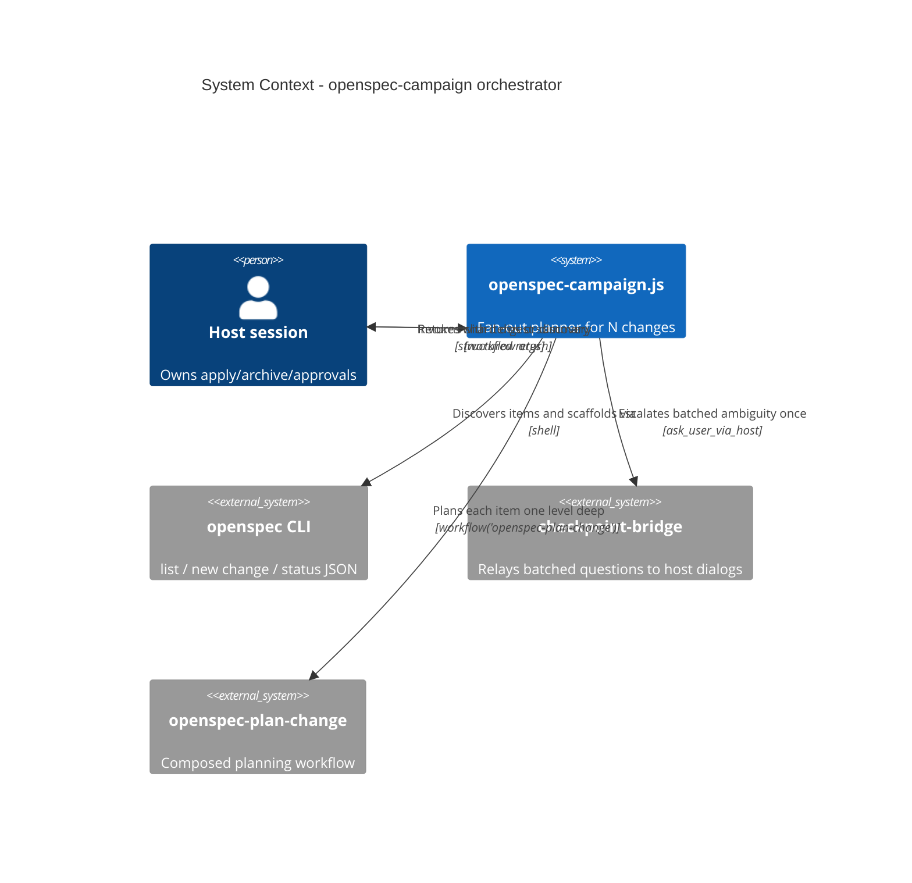
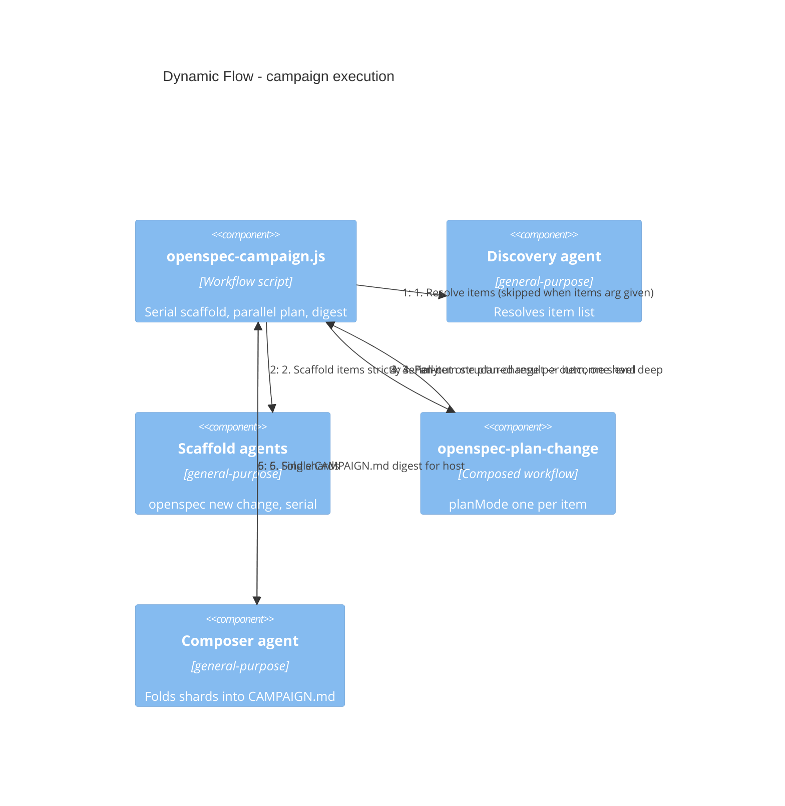

## Context

ADR-0001 (`docs/adr/ADR-0001-workflow-family-and-checkpoint-channel.md`) names `openspec-campaign` as the workflow family's fourth member and arms it behind a measured pilot — the 10-change OpenSpec campaign lived in one session proved that main-session context growth, not sub-agent work, is the dominant cost, and that `openspec list` sweeps, serial scaffolding, and per-item plan-change hand-driving still burden the host. ADR-0002 (`docs/adr/ADR-0002-apply-pipelines-separate-implementation-from-verification.md`) sets the composition rule for this member: the orchestrator composes over plan-change/apply semantics rather than redefining them, inherits the apply/archive/update prohibition verbatim, and treats null/paused agent results conservatively. The proposal (`proposal.md`) fixes the scope: new `openspec-campaign.js`, discovery via `openspec list` or an `items` arg, serial scaffold + parallel plan fan-out, per-item outcomes, shard digest composed into `CAMPAIGN.md`, README args-contract section. The spec (`specs/campaign-orchestrator/spec.md`) pins the requirement scenarios: explicit-items-wins discovery, never-overlapping scaffolds, one-level-deep `planMode: 'one'` fan-out, exactly one of `ok`/`needs_input`/`failed` per item, shard-to-`CAMPAIGN.md` composition with no apply/archive instructions, and the prohibition holding even when all items complete.

Existing structure this design builds on:

- `openspec-plan-change.js` — the composed member: `export const meta` header, named phases (Resolve/Author/QA), JSON schemas per agent, defensive args parse, `mode: 'one' | 'scaffold'`, structured returns with `needs_input`/`error` shapes. Consumed unchanged.
- `openspec-validate-change.js` — confirmed the fan-out/dimension sub-agent pattern the campaign reuses for its per-item planning fan-out.
- `extensions/checkpoint-bridge/` — the checkpoint channel (ADR-0001, process-global bus): serial host dialog queueing makes batched questions mandatory.
- `scripts/check-workflow-syntax.mjs` — the CI gate validating engine-shaped async function bodies (top-level await/return legal).

### C4 view

Level 1 — the orchestrator is a single component of the workflow family; the host, OpenSpec CLI, and checkpoint-bridge are the actors/systems it touches:

Level 4-style dynamic flow — the numbered campaign request flow (the heart of this design):

## Goals / Non-Goals

**Goals:**

- One new workflow script, `openspec-campaign.js`, in house style (`export const meta`, named phases, JSON schemas, defensive args parse, structured returns), validated by `node scripts/check-workflow-syntax.mjs`.
- Item resolution before any per-item work: explicit `items` argument wins; otherwise a discovery agent runs `openspec list`; empty discovery is a degenerate zero-item campaign, not a failure.
- Strictly serial `openspec new change` scaffolding; a scaffold failure records `failed` and continues with later items.
- One-level-deep planning fan-out: exactly one `workflow('openspec-plan-change')` invocation per item, default `planMode: 'one'`.
- Exactly one outcome per item — `ok`, `needs_input`, or `failed` — with no automatic retries and no sibling blocking.
- Shard-digest composition: one composer agent folds per-item shards into a single `CAMPAIGN.md` in the repo root with per-item outcomes, aggregate counts, and host next-actions that never mention apply/archive.
- README.md gains an `openspec-campaign` args-contract section and workflow-table row.

**Non-Goals:**

- No implementation, apply, archive, or update of campaign items — the orchestrator and its agents never run `openspec apply`, `openspec archive`, or `openspec update` (hard prohibition; ADR-0001/ADR-0002 trust model, prompt-contract enforced).
- No deeper authoring inside the campaign: full artifact authoring per item stays a host decision, re-invoked item by item through separate plan-change runs.
- No changes to `openspec-plan-change.js` or `openspec-validate-change.js` — composition only.
- No new extension surface, dependency, or CI change; no sandbox enforcement of the prohibition (ADR-0002 alternative, rejected there, stays rejected).
- No per-item merge of worktrees or test-gate machinery — apply-pipeline options belong to a future apply campaign, not this planning orchestrator.

## Decisions

1. **Composition over redefinition (ADR-0002's follow-up, honored literally).** The orchestrator drives items through `workflow('openspec-plan-change')` and consumes its existing structured returns; it does not re-implement resolve/author/QA or fork plan-change's prompts. *Alternative considered:* a campaign-native per-item author loop (resolve + author + QA phases inline) — rejected because it duplicates plan-change's QA and grill semantics and would drift from it on the first plan-change change; ADR-0002 explicitly assigns composition to this member.

2. **Serial scaffold, parallel plan.** `openspec new change` runs strictly serially — one scaffold agent at a time, each awaited before the next dispatches — because it is a global-mutating operation on the shared `openspec/changes/` directory, the same prohibition class as `archive` per ADR-0001. Planning fan-out via `workflow('openspec-plan-change')` then runs concurrently, one invocation per scaffolded item: plan-change writes only inside its own change root (`resolvedOutputPath` scoping from the CLI), so per-item parallelism is safe. *Alternative:* serializing everything — rejected, it forfeits the parallelism that ADR-0001's measured pilot proved valuable; parallelizing scaffolds — rejected, two `new change` runs racing the shared changes directory is the exact failure class the family prohibits.

3. **One level deep, `planMode: 'one'` default.** Each item gets exactly one plan-change invocation with default `planMode: 'one'` (proposals-only). The lived 10-change campaign showed full authoring per item is dangerous without grill rounds; the campaign therefore never nests plan-change beneath plan-change, and apply-ready/deeper authoring is allowed only per item and only when the host explicitly re-invokes plan-change for that item afterwards. *Alternative:* a `depth`/`planMode` campaign-level argument fanning out multi-artifact authoring — rejected for v1: it concentrates interview load and re-creates the context-growth problem the member exists to escape; a per-item host re-invocation keeps scope authority with the host.

4. **Per-item outcome classification: `ok` | `needs_input` | `failed`, null-as-failed, no blanket retries.** Each item records exactly one outcome: written artifact + QA passed → `ok`; a `needs_input` return from plan-change or a checkpoint-bridge escalation → `needs_input` carrying the batched question text verbatim; a null plan-change result or a resolve failure → `failed`. A failed or blocked item never blocks or restarts siblings, and the orchestrator never re-invokes planning for a settled item — the host decides any re-run. *Note on null semantics:* ADR-0002 makes null a blocker in the apply pipeline because a paused implementer is indistinguishable from non-work; in the campaign a null plan-change result cannot be distinguished from failure either, so the conservative mapping is `failed` — a false failure costs the host one look at the digest, while a false `ok` would poison the aggregate counts the digest exists to provide (the spec's "skipped item is never recorded as success" scenario pins this direction). *Alternative:* automatic retry-once on `failed` — rejected, retries burn context on items that usually need a host decision, and ADR-0001 keeps resumption through host re-invocation, stateless.

5. **Shard-digest + single composer.** Each per-item branch emits a compact shard record (item, mode, outcome, written path, question/assumption lines). After the fan-out settles, one composer agent (schema-validated) folds the shards into a single `CAMPAIGN.md` in the repo root: per-item outcomes, aggregate counts per outcome, and per-item next actions — re-run, interview, or ready for review — never apply/archive/update instructions. If shard composition is ambiguous, the orchestrator asks the host at most once, all questions batched (checkpoint-bridge serial queueing makes batching mandatory per ADR-0001); with no host answer the digest records the ambiguity verbatim instead of guessing. *Alternative:* the orchestrator assembling `CAMPAIGN.md` itself with string templates — rejected: templating prose from a workflow body duplicates the composer pattern the family already uses and gives no QA pass; multiple digests (one per item) — rejected, it re-creates the many-files context cost the digest exists to collapse.

6. **Discovery agent when `items` is omitted.** Without an explicit `items` argument, a minimal-effort discovery agent runs `openspec list` and returns the pending change names plus each item's discovery source (the spec requires recording it); an explicit `items` argument wins outright and no discovery result is merged. *Alternative:* the orchestrator shell-running `openspec list` directly — rejected: workflow bodies orchestrate agents rather than run stateful parsing themselves in the family's established shape, and the agent boundary keeps `openspec list` output parsing out of the orchestration body.

7. **Hard prohibition carried as verbatim prompt-contract lines.** Every agent prompt in the script includes the family's contract lines (mirroring `openspec-plan-change.js`'s TOOL/CONTRACT/GRILL constants): never run `openspec apply`, `openspec archive`, or `openspec update`; never move or sync state; the digest directs the host to review and decide apply/archive in the main session — even when every item is `ok`. *Alternative:* sandbox enforcement — rejected, per ADR-0002's recorded alternative (no workflow code path invokes the verbs; no sandbox without a demonstrated bypass).

8. **Args surface mirrors plan-change's defensive parse.** `openspec-campaign.js` accepts `items` (array, optional), `intent` (string passed through to each plan-change invocation), and `repoRoot`/`store` forwarded into shell prefixes exactly as plan-change does; a JSON-encoded string args transport is defensively parsed. No `depth` or `planMode` override argument exists in v1 (Decision 3).

## Risks / Trade-offs

- [Parallel plan-change fan-out interleaves grill rounds from several items at the host] -> Checkpoint-bridge already queues dialogs serially (ADR-0001); plan-change batches its questions per invocation; the campaign adds no questions of its own except the single batched composer ambiguity escalation (Decision 5). Digest's `needs_input` items tell the host which interviews to hold.
- [Null plan-change result misread as failure when it was a user skip] -> Accepted trade-off in the safe direction (Decision 4): the shard records `failed` with the resolve/plan failure line, and the digest's next action is "inspect then re-run or interview" — the host re-runs per item, statelessly.
- [Composer hallucinates apply/archive guidance into CAMPAIGN.md] -> Composer prompt carries the verbatim prohibition lines; the orchestrator post-checks the composed digest for apply/archive/update instruction strings before returning, and strips/records a violation as an assumption line rather than shipping it.
- [Large campaigns (N tens of items) still grow main-session context through the return value] -> The workflow returns only the digest path plus aggregate counts, not full shard contents; shards live in the composer's context, not the host's — the same containment argument that justified the family in ADR-0001.
- [Scaffold-failure items leave a half-created change root] -> The shard records the failure verbatim; the digest flags such items for host inspection rather than attempting deletion or repair (no `openspec update`-class verbs are permitted to clean up).
- [Discovery picks up changes the host did not intend to campaign] -> Explicit `items` wins and is the documented path for curated campaigns; README's args contract says so, and discovery records its source per item so the digest is auditable.

## Migration Plan

1. Add `openspec-campaign.js` at the repo root next to `openspec-plan-change.js` (edit at source; installed copies are sync outputs, never edit targets). No dependency or CI changes — the existing `node scripts/check-workflow-syntax.mjs` gate covers the new script.
2. Extend `README.md`: new `openspec-campaign` args-contract section (items / intent / repoRoot / store) and a workflow-table row listing it as the family's fourth member, planning-only.
3. Validate with `openspec validate add-openspec-campaign-orchestrator --type change --strict` and run prek hygiene at source.
4. Pilot gate (ADR-0001 follow-up): first live run should be a small campaign (2–3 items) with the host watching serial scaffolding and the digest composition; measure against the archived 10-change campaign before treating the member as armed.
5. Rollback: the script is additive — removing the file and the README section restores the prior state; no CLI, spec, or extension state is migrated, and `CAMPAIGN.md` is a disposable artifact the host can delete.

## Open Questions

- Should a future campaign mode fan out apply pipelines per item (composing ADR-0002's apply semantics with per-item worktrees and test gates)? Deliberately out of scope here; if the planning pilot shows host appetite, that mode gets its own change and likely its own ADR rather than growing into this one.
- Should the digest live at a configurable path instead of the repo root? Fixed at `CAMPAIGN.md` in the repo root for v1 (spec pins it); revisit only if multi-campaign concurrent runs in one repo become a real pattern.
- No in-force ADR needs supersession: both ADR-0001 and ADR-0002 are accepted, unsuperseded, and this design is coherent with their in-force decisions — the campaign composes plan-change per ADR-0002's follow-up and inherits ADR-0001's scope discipline verbatim.
